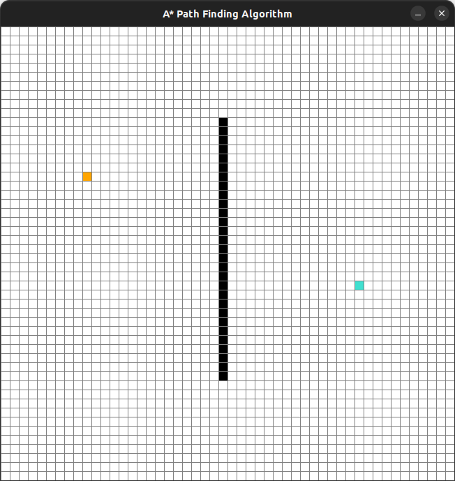
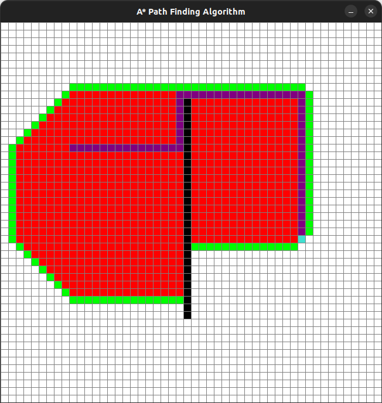

# A-Star Pathfinder
A python based visualizer for A* pathfinding algorithm.

## Before using A* Algorithm
Select the start and end point by clicking any of the box in the grid.
    _(First click corresponds to the start point and the Second click corresponds to the end point)_

Then click anywhere in the grid to draw obstacles in the path that the algorithm has to avoid.

Press `Space` to start the visualization of the algorithm and see the result _(the shortest path possible)_ drawn by the algorithm.

## Result Path by the A* Algorithm

Press `Enter` to clear the grid and draw new maps to play with.